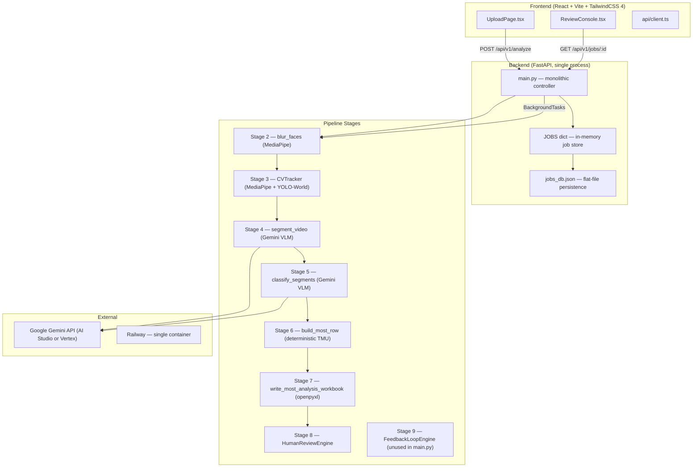

# Factory Video Analysis — Current System Audit

> **Branch**: `feature/saas-workstations`  
> **Date**: 2026-07-29  
> **Baseline check**: 62/62 backend tests ✅ | Frontend build ✅

---

## 1. Existing Architecture



### Key characteristics
- **Single-process, single-worker**: Railway runs one `uvicorn` process, one worker. No task queue. Background jobs run via FastAPI `BackgroundTasks` (in-process threads).
- **No database**: State is an in-memory Python `dict` (`JOBS`) backed by a flat JSON file (`jobs_db.json`).
- **No user/tenant concept**: Zero authentication, zero authorization. All jobs live in a single global namespace.
- **Ephemeral container**: Railway containers restart frequently. `JOBS` dict is empty after restart; `jobs_db.json` persists only if Railway's ephemeral volume survives (not guaranteed on redeploys).

---

## 2. Current API Endpoints

| Method | Path | Purpose | Auth |
|--------|------|---------|------|
| `POST` | `/api/v1/analyze` | Upload video → start analysis pipeline | None |
| `POST` | `/api/v1/analyze/sample` | Run pipeline on bundled sample video | None |
| `POST` | `/api/v1/analyze/demo` | Generate pre-fabricated demo result instantly | None |
| `GET` | `/api/v1/jobs/{job_id}` | Poll job status, phase, row/flag counts | None |
| `GET` | `/api/v1/jobs/{job_id}/rows` | Get MOST rows (live-updating during processing) | None |
| `GET` | `/api/v1/jobs/{job_id}/video` | Stream blurred video (Range header support) | None |
| `GET` | `/api/v1/jobs/{job_id}/excel` | Download finalized Excel report | None |
| `GET` | `/api/v1/jobs/{job_id}/flags` | Get unresolved review flags | None |
| `POST` | `/api/v1/jobs/{job_id}/review` | Submit human classification correction | None |
| `GET` | `/{path}` | Catch-all serving React SPA from `frontend/dist` | None |

---

## 3. Current Frontend Routes

| Route | Component | Description |
|-------|-----------|-------------|
| `/` | `UploadPage` | Video upload form, demo/sample buttons |
| `/jobs/:jobId` | `ReviewConsole` | Real-time phase tracker, video player, report feed, timeline, review flags |

---

## 4. Existing Job Persistence Method

```
JOBS: Dict[str, Dict[str, Any]]     ← in-memory, process-scoped
   ↕ (serialized/deserialized via _save_jobs_to_disk / _load_jobs_from_disk)
jobs_db.json                         ← flat file in data/uploads/
```

- `_save_jobs_to_disk()`: Serializes every job's status, rows, segments, flags to JSON. Called after every state mutation.
- `_load_jobs_from_disk()`: Called once at module import time (line 134). Reconstructs `JOBS` dict and re-creates `HumanReviewEngine` instances.
- **No atomic writes**: Uses `tmp → rename` pattern (good), but no locking.
- **No pagination**: The entire jobs dict is serialized/deserialized every time.
- **analysis_dir not persisted in JSON**: `analysis_dir` is stored as a runtime `Path` object in the dict but is NOT serialized to `jobs_db.json`. This means video streaming (`/video`) and Excel download (`/excel`) break after a server restart because `job.get("analysis_dir")` returns `None`.

---

## 5. Existing Video Storage Method

```
data/uploads/
  analysis_{uuid}/
    original.mp4     ← raw upload (deleted in finally block after processing)
    blurred.mp4      ← face-blurred output (kept for UI player)
    report.xlsx      ← generated Excel
    report.json      ← generated JSON
  jobs_db.json       ← flat-file job persistence
```

- Storage cleanup runs at 3 points: startup, before upload, after processing.
- Enforces max 5 `analysis_*` folders (oldest deleted by `enforce_storage_limits`).
- 250 MB safety buffer on disk space check.
- Post-processing `finally` block deletes everything except `{blurred.mp4, report.xlsx, report.json}`.

---

## 6. Existing Gemini Calls

| Call | Stage | Method | Purpose |
|------|-------|--------|---------|
| `upload_video` | Pre-Stage 4 | `client.files.upload()` + poll | Upload blurred video to Gemini Files API |
| `segment_video` | Stage 4 | `generate_content` (JSON schema output) | VLM temporal segmentation with motion-event anchoring |
| `classify_segments` | Stage 5 | `generate_content` (JSON schema output) | Structured MOST classification per segment |

- Both calls use `_generate_content_with_retry` which tries multiple model candidates (`gemini-2.0-flash`, `gemini-2.5-flash`, `gemini-flash-latest`) with 5 retries each, cascading on 404/429 errors.
- Video is sent as a `types.File` reference (uploaded via Files API), not inline bytes.
- Classification call does NOT send the video — only the segment listing text. This is a cost optimization.

---

## 7. Existing Report-Generation Flow

1. **Stage 6** (`build_most_row`): Pure deterministic math. `TMU = SUM(params) * 10 * freq` (G/C/T cards) or `freq * seconds / 0.036` (PT card).
2. **Stage 7** (`write_most_analysis_workbook`): Copies the real Excel template, writes rows with live formulas, adds traceability columns (AD–AN), creates Activity Timeline Chart sheet.
3. **JSON dump**: `report.json` written alongside Excel.
4. **Human review**: `HumanReviewEngine` allows correcting a flagged segment's classification, re-validates against MOST tables, recomputes TMU, re-writes Excel.

---

## 8. Risks Blocking Multi-User Production Use

### 🔴 Critical

| # | Risk | Impact |
|---|------|--------|
| 1 | **No authentication/authorization** | Any user can access/modify any other user's jobs, videos, reports |
| 2 | **Global in-memory `JOBS` dict** | All users share one dict; no tenant isolation; dict grows unbounded; lost on restart |
| 3 | **Single-worker `BackgroundTasks`** | Only one analysis can run at a time; second upload blocks until first finishes |
| 4 | **No database** | `jobs_db.json` is a single flat file — concurrent writes corrupt it; no indexing; no transactions |
| 5 | **`analysis_dir` not persisted** | After restart, video streaming and Excel downloads return 404 |
| 6 | **Hardcoded local paths** | `analyze_demo` references `C:\Users\ipate\Downloads\kit.mp4` — crashes on Railway |
| 7 | **No workstation/factory concept** | All uploads dumped into one flat namespace; no organization |

### 🟡 Important

| # | Risk | Impact |
|---|------|--------|
| 8 | **Single Gemini API key** | All users share one key; rate limits hit quickly under concurrent use |
| 9 | **No CORS restrictions** | `allow_origins=["*"]` — acceptable for dev, not for production |
| 10 | **Stage 9 (FeedbackLoop) not wired** | `stage9_feedback_loop.py` exists but is never called from `_process_video_job` |
| 11 | **`ReviewFlag` schema mismatch** | Backend `ReviewFlag` has no `attempted_*` fields but frontend `types.ts` expects them |
| 12 | **No job listing endpoint** | Frontend cannot display a list of past analyses |
| 13 | **No video re-encoding to H.264** | `blur_faces` uses `cv2.VideoWriter` with `mp4v` codec — browsers cannot play it (need H.264) |

---

## 9. Files That Will Need to Be Changed

### Backend

| File | Changes needed |
|------|---------------|
| `backend/app/main.py` | Extract monolith → route modules; add auth middleware; replace `JOBS` dict with DB; add workstation CRUD; fix `analysis_dir` persistence; add job listing endpoint |
| `backend/app/models/schemas.py` | Add `Workstation`, `User` models; add `workstation_id` to `MostRow`/`Segment` |
| `backend/app/services/storage_cleanup.py` | Adapt to per-workstation storage paths |
| `backend/app/services/gemini_client.py` | No changes needed (already parameterized) |
| `backend/app/pipeline/stage2_preprocessing.py` | No changes needed |
| `backend/app/pipeline/stage3_cv_tracking.py` | No changes needed |
| `backend/app/pipeline/stage4_segmentation.py` | No changes needed |
| `backend/app/pipeline/stage5_classification.py` | No changes needed |
| `backend/app/pipeline/stage6_tmu_engine.py` | No changes needed |
| `backend/app/pipeline/stage7_excel_writer.py` | No changes needed |
| `backend/app/pipeline/stage8_human_review.py` | No changes needed |
| `backend/app/pipeline/stage9_feedback_loop.py` | Wire into pipeline if desired |
| `backend/requirements.txt` | Add DB driver if needed |
| `Dockerfile` | No changes expected |

### Frontend

| File | Changes needed |
|------|---------------|
| `frontend/src/api/client.ts` | Add workstation endpoints; add auth headers |
| `frontend/src/api/types.ts` | Add `Workstation` type; fix `ReviewFlag` mismatch |
| `frontend/src/App.tsx` | Add workstation routes, job history route |
| `frontend/src/pages/UploadPage.tsx` | Add workstation selector; add job history |
| `frontend/src/pages/ReviewConsole.tsx` | Minor — add workstation context display |

---

## 10. Proposed Migration Sequence

| Phase | Scope | Risk |
|-------|-------|------|
| **Phase A**: Data model | Add `Workstation` schema, workstation CRUD endpoints, workstation-scoped storage paths. No DB yet — extend `jobs_db.json` format. | Low |
| **Phase B**: Job persistence fix | Persist `analysis_dir` to `jobs_db.json`; reconstruct on load. Fix video/excel 404 after restart. | Low |
| **Phase C**: Frontend workstation UI | Workstation selector on Upload page; workstation context in Review page; job history listing. | Medium |
| **Phase D**: Auth & tenant isolation | API key or session auth; scope all endpoints to authenticated user/workstation. | Medium |
| **Phase E**: Database migration | Replace `jobs_db.json` with SQLite or PostgreSQL; proper indexes, transactions, concurrent safety. | High |
| **Phase F**: Task queue | Replace `BackgroundTasks` with Celery/ARQ for concurrent analysis, restart resilience. | High |

---

## 11. Existing Bugs Discovered

| # | Bug | Location | Severity |
|---|-----|----------|----------|
| 1 | **`analysis_dir` not serialized to `jobs_db.json`** — after restart, `get_job_video` and `download_excel_report` both call `job.get("analysis_dir")` which returns `None`, causing `AttributeError` or `TypeError` when calling `.exists()` on `None`. | [main.py L64-94](file:///c:/Users/Ricky/OneDrive/Desktop/sway/Factory_Video_Analysis/backend/app/main.py#L64-L94) (serialize) and [L574-593](file:///c:/Users/Ricky/OneDrive/Desktop/sway/Factory_Video_Analysis/backend/app/main.py#L574-L593) (consume) | 🔴 Critical |
| 2 | **Hardcoded local path `C:\Users\ipate\Downloads\kit.mp4`** — crashes on Railway with FileNotFoundError. | [main.py L356](file:///c:/Users/Ricky/OneDrive/Desktop/sway/Factory_Video_Analysis/backend/app/main.py#L356) and [L383](file:///c:/Users/Ricky/OneDrive/Desktop/sway/Factory_Video_Analysis/backend/app/main.py#L383) | 🟡 Medium |
| 3 | **`ReviewFlag` frontend/backend schema mismatch** — Frontend `types.ts` expects `attempted_data_card`, `attempted_param_values`, `attempted_muda_ref` fields. Backend `ReviewFlag` schema has `suggested_card` and `suggested_params` (only in demo endpoint) but no `attempted_*` fields at all. | [types.ts L70-72](file:///c:/Users/Ricky/OneDrive/Desktop/sway/Factory_Video_Analysis/frontend/src/api/types.ts#L70-L72) vs [schemas.py L109-118](file:///c:/Users/Ricky/OneDrive/Desktop/sway/Factory_Video_Analysis/backend/app/models/schemas.py#L109-L118) | 🟡 Medium |
| 4 | **Stage 9 never wired** — `FeedbackLoopEngine` exists with full implementation but is never called from `_process_video_job` or the review submission endpoint. Human corrections are never recorded for future prompt improvement. | [stage9_feedback_loop.py](file:///c:/Users/Ricky/OneDrive/Desktop/sway/Factory_Video_Analysis/backend/app/pipeline/stage9_feedback_loop.py) | 🟡 Medium |
| 5 | **Duplicate `import json`** — `json` is imported at module top (L12) and again inside `_process_video_job` (L261) and `analyze_demo_video` (L478). | [main.py L12](file:///c:/Users/Ricky/OneDrive/Desktop/sway/Factory_Video_Analysis/backend/app/main.py#L12), [L261](file:///c:/Users/Ricky/OneDrive/Desktop/sway/Factory_Video_Analysis/backend/app/main.py#L261), [L478](file:///c:/Users/Ricky/OneDrive/Desktop/sway/Factory_Video_Analysis/backend/app/main.py#L478) | 🟢 Minor |
| 6 | **`blurred.mp4` encoded with `mp4v` codec** — `cv2.VideoWriter` uses `mp4v` (MPEG-4 Part 2), which most browsers cannot play natively. Requires H.264 re-encoding via ffmpeg for reliable browser playback. Currently works only because some browsers/OS combinations fall back to system codecs. | [stage2_preprocessing.py L33](file:///c:/Users/Ricky/OneDrive/Desktop/sway/Factory_Video_Analysis/backend/app/pipeline/stage2_preprocessing.py#L33) | 🟡 Medium |
| 7 | **`elapsed_sec` wrong after restart** — Uses `time.monotonic()` for `started_at` / `completed_at`, which resets to 0 on restart. After loading from disk, `elapsed_sec` defaults to `30.0` (hardcoded fallback at L122) regardless of actual duration. | [main.py L122](file:///c:/Users/Ricky/OneDrive/Desktop/sway/Factory_Video_Analysis/backend/app/main.py#L122) | 🟢 Minor |
