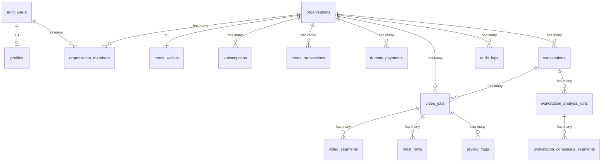

# Supabase Database — Factory Video Analysis SaaS

## Directory Structure

```
supabase/
├── migrations/
│   └── 001_saas_core.sql     # Full schema: 15 tables, ENUMs, indexes,
│                               # triggers, helper functions, RLS policies
├── seed.sql                   # Dev seed data (documented examples)
└── README.md                  # This file
```

## Prerequisites

- [Supabase CLI](https://supabase.com/docs/guides/cli) installed
- Docker running (for local Supabase)
- Or a remote Supabase project for cloud deployment

## Local Development

### Start local Supabase

```bash
supabase start
```

### Apply migrations

```bash
supabase db push
```

### Reset database (drop + recreate + migrate + seed)

```bash
supabase db reset
```

### View local Supabase Studio

Open http://localhost:54323

## Cloud Deployment

### Link to your Supabase project

```bash
supabase link --project-ref YOUR_PROJECT_REF
```

### Push migrations to cloud

```bash
supabase db push
```

## Migration Details

### 001_saas_core.sql

**15 tables created:**

| # | Table | Purpose |
|---|-------|---------|
| 1 | `profiles` | User profiles (auto-created on auth sign-up) |
| 2 | `organizations` | Tenant containers (factories) |
| 3 | `organization_members` | User ↔ Org membership with role |
| 4 | `subscriptions` | Plan tracking per organization |
| 5 | `credit_wallets` | Balance tracking (available + reserved) |
| 6 | `credit_transactions` | Full credit ledger with idempotency |
| 7 | `dummy_payments` | Simulated payment records |
| 8 | `workstations` | Named work stations within a factory |
| 9 | `video_jobs` | Video analysis job tracking |
| 10 | `video_segments` | VLM-detected temporal segments |
| 11 | `most_rows` | Complete MOST analysis rows |
| 12 | `review_flags` | Human review flag tracking |
| 13 | `workstation_analysis_runs` | Cross-video consensus analysis runs |
| 14 | `workstation_consensus_segments` | Verified consensus segments |
| 15 | `audit_logs` | Full audit trail |

**Triggers:**
- `handle_new_user()` — on `auth.users` INSERT → creates profile, org, membership, wallet
- `trigger_set_updated_at()` — auto-updates `updated_at` on 6 tables

**Helper functions:**
- `is_org_member(org_id)` — returns true if current auth user belongs to org
- `has_org_role(org_id, role)` — returns true if user has the specified role or higher
- `get_org_role(org_id)` — returns the user's role in the org

**RLS policies:** Every table has Row Level Security enabled with policies scoped to organization membership and role hierarchy:
- `viewer` → read-only access
- `engineer` → can create jobs, segments, rows, flags
- `admin` → can manage workstations and members
- `owner` → full access including org settings

**Credit mutations** (wallets, transactions) have no user-facing write policies — they are modified only through backend service-role calls.

## Rollback

### Full rollback of 001_saas_core.sql

To completely reverse this migration, run the following SQL in order:

```sql
-- 1. Drop triggers
DROP TRIGGER IF EXISTS on_auth_user_created ON auth.users;
DROP TRIGGER IF EXISTS set_updated_at_profiles ON profiles;
DROP TRIGGER IF EXISTS set_updated_at_organizations ON organizations;
DROP TRIGGER IF EXISTS set_updated_at_workstations ON workstations;
DROP TRIGGER IF EXISTS set_updated_at_video_jobs ON video_jobs;
DROP TRIGGER IF EXISTS set_updated_at_most_rows ON most_rows;
DROP TRIGGER IF EXISTS set_updated_at_credit_wallets ON credit_wallets;

-- 2. Drop functions
DROP FUNCTION IF EXISTS handle_new_user();
DROP FUNCTION IF EXISTS trigger_set_updated_at();
DROP FUNCTION IF EXISTS is_org_member(UUID);
DROP FUNCTION IF EXISTS has_org_role(UUID, org_role);
DROP FUNCTION IF EXISTS get_org_role(UUID);

-- 3. Drop tables (reverse dependency order)
DROP TABLE IF EXISTS audit_logs CASCADE;
DROP TABLE IF EXISTS workstation_consensus_segments CASCADE;
DROP TABLE IF EXISTS workstation_analysis_runs CASCADE;
DROP TABLE IF EXISTS review_flags CASCADE;
DROP TABLE IF EXISTS most_rows CASCADE;
DROP TABLE IF EXISTS video_segments CASCADE;
DROP TABLE IF EXISTS credit_transactions CASCADE;
DROP TABLE IF EXISTS video_jobs CASCADE;
DROP TABLE IF EXISTS dummy_payments CASCADE;
DROP TABLE IF EXISTS credit_wallets CASCADE;
DROP TABLE IF EXISTS workstations CASCADE;
DROP TABLE IF EXISTS subscriptions CASCADE;
DROP TABLE IF EXISTS organization_members CASCADE;
DROP TABLE IF EXISTS organizations CASCADE;
DROP TABLE IF EXISTS profiles CASCADE;

-- 4. Drop ENUMs
DROP TYPE IF EXISTS consensus_decision;
DROP TYPE IF EXISTS analysis_run_status;
DROP TYPE IF EXISTS flag_status;
DROP TYPE IF EXISTS job_phase;
DROP TYPE IF EXISTS job_status;
DROP TYPE IF EXISTS workstation_status;
DROP TYPE IF EXISTS payment_status;
DROP TYPE IF EXISTS credit_tx_type;
DROP TYPE IF EXISTS subscription_status;
DROP TYPE IF EXISTS org_role;
```

### Alternative: reset entire local DB

```bash
supabase db reset
```

This drops everything and re-applies all migrations from scratch.

## Schema Diagram


